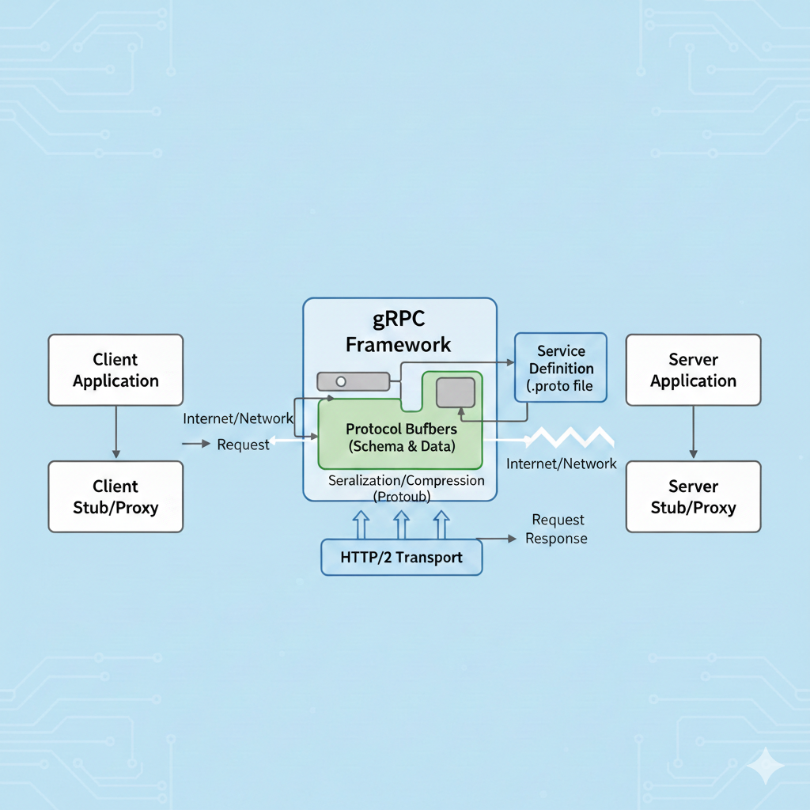
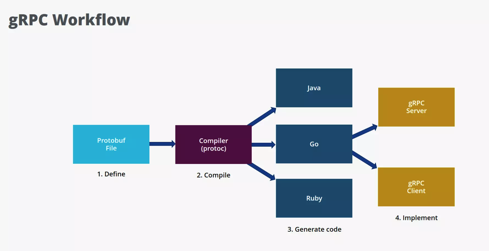

# gRPC: The contract-first RPC that runs the backend


**Your services talk over JSON until one deploy renames a field and breaks production. Here’s what to use instead—and when not to.**


You’ve got services talking to each other over HTTP and JSON. It works—until you have thousands of RPS, a dozen languages, and that one bad deploy. gRPC is what many teams reach for when that starts to hurt. This piece is about what it is, why it helps, how to use it, and when to pick something else.


---


## Calling a function on another machine


**gRPC** (gRPC Remote Procedure Call) does one thing: it lets a client call a method on a server on another machine as if it were a local function. No URLs, no verbs—just “call this method with these arguments.” It came out of Google’s internal RPC system (“Stubby”), was open-sourced in 2015, and now shows up everywhere people run serious service-to-service traffic.

Two things make it what it is:

1. **Protocol Buffers (Protobuf)** — A schema language (`.proto` files) and a binary serialization format. You define messages and services once; tooling generates type-safe client and server code and handles encoding/decoding. The wire format is binary, not text.
2. **HTTP/2** — The transport. Multiple requests and responses can share one TCP connection (multiplexing), and both sides can stream data over the same connection.

So: **contract in `.proto`, binary on the wire, HTTP/2 underneath.** It’s a full RPC stack, not “REST with a different encoding.”

One server can speak to many clients in different languages; each client uses a generated stub and exchanges **Proto Request** / **Proto Response(s)** with the server. The diagram below shows that idea.

---


*One server (e.g. C++), many clients (e.g. Ruby, Android-Java). Each client has a gRPC stub; all talk the same Proto contract.*

---
### How it compares to REST (and why that matters)


| Aspect | REST (typical: JSON over HTTP/1.1) | gRPC (Protobuf over HTTP/2) |
|--------|-----------------------------------|-----------------------------|
| **Data format** | Text (JSON/XML) | Binary (Protobuf) |
| **Contract** | Optional (OpenAPI/Swagger) | Required (`.proto` is the source of truth) |
| **Performance** | Moderate (parsing and payload overhead) | High (often much faster, especially at scale) |
| **Communication** | Request/response only | Unary + server streaming + client streaming + bidirectional |
| **Browser support** | Native | Needs a proxy (e.g. gRPC-Web + Envoy) |

---

### REST talks in resources; gRPC talks in methods


**REST** is resource-oriented. You work with nouns and HTTP verbs:

- `GET /users/123`
- `POST /payments`
- `DELETE /sessions/45`

**RPC** is procedure-oriented. You call remote functions by name:

- `userService.GetUser({ id: 123 })`
- `paymentService.CreatePayment(data)`


| | REST | RPC (e.g. gRPC) |
|---|------|------------------|
| Focus | Resources (URLs) | Methods (functions) |
| Structure | Often loose; docs and conventions | Strict contract from schema |
| Typing | Optional | Enforced by generated code |


gRPC gives you RPC with strong typing, code generation, and a single contract shared across languages.


---


## How the three parts work together


gRPC is built in layers: your application code (and the generated stubs) sits on top; the gRPC framework handles the protocol, serialization, and language bindings; HTTP/2 is the transport at the bottom. The diagram below shows how a request flows from the client application to the server and back.



*Client app → Client stub → (request over network) → gRPC framework (Protobuf + HTTP/2) → Server stub → Server app. The response follows the same path back. The `.proto` file defines the contract; both stubs are generated from it.*


---


## Three problems gRPC was built to fix


### The JSON tax


JSON is human-readable but heavy. Field names are repeated on every message. A small object might be 80 bytes in JSON; the same data in Protobuf can be on the order of 20 bytes, because the schema (field names) isn’t sent—only field numbers and values are. Less data means less bandwidth and less CPU for parsing. At high QPS or with large payloads, this adds up.


### Head-of-line blocking and connection churn


With HTTP/1.1, you often get one request per connection (or limited pipelining). A slow request blocks others on that connection. Opening a new connection per request adds TCP and TLS handshake cost. HTTP/2 gives gRPC:

- **Multiplexing** — Many requests and responses over one TCP connection, so one slow RPC doesn’t block others.
- **Persistent connections** — Reuse one connection for many calls, cutting handshake overhead.

So you get better throughput and lower latency when many calls are in flight.


### Contract drift and the “undefined” bug


With REST, someone can rename `user_id` to `uid` or change types, and clients break in subtle ways. With gRPC, the `.proto` file is the contract. Client and server code are generated from it. If you change the contract in a breaking way, the code no longer compiles—you catch the break at build time instead of in production.


### Where it actually shines


- **Microservices** — Service-to-service calls where you control both ends.
- **Kubernetes / service meshes** — Internal APIs, sidecars, and mesh traffic.
- **High-throughput or latency-sensitive systems** — Trading, fintech, real-time analytics, ad serving.
- **Polyglot backends** — One `.proto` drives Go, Java, Node, Python, etc., with consistent types and semantics.
- **Streaming** — Feeds, logs, uploads, real-time chat, or any “many messages over one RPC.”

Companies like Netflix, Uber, and Cloudflare use gRPC internally for these reasons. It’s not about replacing REST everywhere; it’s about using the right tool for internal, performance-sensitive, contract-driven communication.


---


## Define once, generate everywhere


There’s really one workflow. You repeat it for every service:

1. **Define** — Write a `.proto` file: services (RPC methods) and messages (request/response types).
2. **Generate** — Run `protoc` with the gRPC plugin for your language(s) to get client stubs, server interfaces, and serialization code.
3. **Implement** — Implement the server methods; use the generated client to call them.





*One `.proto` file, one compiler, many languages. Then you implement server and client using the generated code.*

---

### Writing the contract (`.proto`)


Example:

```protobuf
syntax = "proto3";

package math;

service Calculator {
  rpc Add (AddRequest) returns (AddResponse);
}

message AddRequest {
  int32 a = 1;
  int32 b = 2;
}

message AddResponse {
  int32 result = 1;
}
```

- `service` defines the RPC (here, unary: one request, one response).
- `message` defines the shape of the data. The `= 1`, `= 2` are **field numbers**; they’re part of the wire format and must stay stable for compatibility (see the section on schema evolution below).


### Generating stubs


Use `protoc` and the gRPC plugin for your language, for example:

- Go: `protoc --go_out=... --go-grpc_out=... math.proto`
- TypeScript/Node: `protoc` with `grpc_tools_node_protoc_ts` or similar
- Python: `python -m grpc_tools.protoc ...`

You get generated types and stubs; you don’t hand-write serialization or HTTP/2 framing.

---

### Implementing server and client


**Server (Go example):**

```go
package main

import (
    "context"
    "net"
    "google.golang.org/grpc"
    pb "path/to/generated/math"
)

type server struct {
    pb.UnimplementedCalculatorServer
}

func (s *server) Add(ctx context.Context, req *pb.AddRequest) (*pb.AddResponse, error) {
    return &pb.AddResponse{Result: req.A + req.B}, nil
}

func main() {
    lis, _ := net.Listen("tcp", ":50051")
    s := grpc.NewServer()
    pb.RegisterCalculatorServer(s, &server{})
    s.Serve(lis)
}
```

**Client (TypeScript/Node example):**

```typescript
import * as grpc from '@grpc/grpc-js';
import { CalculatorClient } from './generated/math_grpc_pb';
import { AddRequest } from './generated/math_pb';

const client = new CalculatorClient(
  'localhost:50051',
  grpc.credentials.createInsecure()
);

const request = new AddRequest();
request.setA(10);
request.setB(20);

client.add(request, (error, response) => {
  if (!error) {
    console.log('Result:', response.getResult()); // 30
  }
});
```

The same `.proto` works for Go, TypeScript, Python, Java, etc.—that’s the point of contract-first RPC.


---


## Why the wire format doesn’t send field names


Protobuf isn’t “JSON with types.” It’s a different design:

- **Binary serialization** — Compact, fast to encode/decode, low CPU. No repeated field names on the wire.
- **Strong typing** — Generated code is typed. Sending a number where a string is expected is a compile-time error, not a runtime surprise.
- **Backward compatibility** — Field identity is the **number** (`= 1`, `= 2`), not the name. Old clients can ignore new fields; new clients can treat missing old fields as default values. That lets you evolve the API without a big-bang rollout.


### The rules that keep old and new code working together


- **Never reuse field numbers** — Once used, a number is reserved for the life of the API.
- **Add new fields with new numbers** — Old code ignores them; new code can depend on them.
- **Don’t remove fields carelessly** — Prefer marking as deprecated or reserving the number so no one reuses it. If you remove a field, old clients may still send it; the wire format allows unknown fields to be ignored.

If you follow these rules, different versions of clients and servers can coexist.


---


## One connection, many requests


gRPC is tied to HTTP/2. That’s what enables both its performance and its streaming story.

- **Multiplexing** — One TCP connection carries many logical streams (request/response pairs). A slow RPC doesn’t block others on the same connection. No head-of-line blocking like in HTTP/1.1.
- **Persistent connections** — Clients reuse connections. Fewer TCP handshakes and TLS negotiations, which matters at high QPS.
- **Full-duplex** — Client and server can send at the same time. You don’t need a separate mechanism (like WebSockets) for bidirectional streaming; it’s built in.

So gRPC isn’t “HTTP/1.1 with binary bodies”—it’s a different transport model that fits RPC and streaming well.


---


## Unary, streams, and the one that isn’t REST


gRPC supports four ways to call a method. Only the first looks like classic REST; the other three are where the protocol earns its keep. Here’s how the four patterns look in terms of who sends what.


### Unary

One request, one response.

```
  Client  ────── request ──────►  Server
  Client  ◄───── response ──────  Server
```

The client sends a single message and waits for a single response. Semantically it’s the same as a REST call: you invoke something, you get something back. This is what you use for most “call a method, get a result” APIs—lookups, mutations, anything that doesn’t need a long-lived stream. If you’re not sure, start here.


### Server streaming

One request, many responses over time.

```
  Client  ────── request ──────►  Server
  Client  ◄───── response 1 ───  Server
  Client  ◄───── response 2 ───  Server
  Client  ◄───── response 3 ───  Server
  ...
```

The client sends one message; the server replies with a sequence of messages on the same RPC. The stream stays open until the server is done or the client cancels. Good when the server has a lot of data to push and the client doesn’t need to send anything else after the initial request.

**Typical use:** Activity feeds, log tailing, market data feeds, “subscribe and get updates,” or any long-running read that produces multiple chunks.


### Client streaming

Many requests, one response.

```
  Client  ────── request 1 ───►  Server
  Client  ────── request 2 ───►  Server
  Client  ────── request 3 ───►  Server
  ...
  Client  ◄───── response ──────  Server
```

The client sends a sequence of messages; the server processes them and returns a single response (often a summary or acknowledgment). The client controls the pace and can send a lot of data without waiting for per-message replies.

**Typical use:** File or chunked uploads, bulk ingestion, metrics batching, or any case where you’re sending many small pieces and want one final answer.


### Bidirectional streaming

Both sides send and receive over the same call.

```
  Client  ────── msg ─────────►  Server
  Client  ◄───── msg ─────────  Server
  Client  ────── msg ─────────►  Server
  Client  ◄───── msg ─────────  Server
  ... (independent streams both ways)
```

Client and server can both send and receive at the same time over the same call. Neither side has to wait for the other to finish before sending the next message. REST has no built-in equivalent; you’d typically bolt on WebSockets or similar. In gRPC it’s a first-class pattern.

**Typical use:** Chat, trading engines, multiplayer games, real-time collaboration, or any event-driven flow where both sides produce and consume messages. This is where gRPC really stands out compared to classic REST.


### Metadata


Metadata is key-value data sent with every request or response—similar to HTTP headers. You use it for auth tokens, request IDs, tracing headers, or any data that isn’t part of the message body. Both client and server can read and set metadata.


### Interceptors


Interceptors are gRPC’s middleware: they run around each RPC call (before and after). Use them for auth, logging, metrics, tracing, or error handling so you don’t repeat that logic in every handler. They work on both the client and the server.


**In the `.proto` you declare streaming with the `stream` keyword:**

```protobuf
service Example {
  rpc Unary(Req) returns (Resp);
  rpc ServerStream(Req) returns (stream Resp);
  rpc ClientStream(stream Req) returns (Resp);
  rpc Bidirectional(stream Req) returns (stream Resp);
}
```

`stream` on the request type means the client streams; `stream` on the response type means the server streams. Both means bidirectional.


---


## Where the speed actually comes from


It’s not magic. The gains come from:

- **Binary serialization** — Smaller payloads and less CPU than JSON.
- **HTTP/2 multiplexing** — Better use of each connection, less blocking.
- **Persistent connections** — No per-request connection setup.
- **Efficient framing** — gRPC’s use of HTTP/2 frames and compression (e.g. for headers) reduces overhead.

In internal service meshes, where one user request can trigger many service-to-service calls, these effects compound. You’re not just making one call faster; you’re making the whole chain more efficient.


---


## What production gRPC demands


- **Treat the `.proto` as the contract** — Version it, review changes, and document evolution rules. Never reuse or remove field numbers without a plan.
- **Set deadlines (timeouts) on every call** — And propagate them through the call chain. Without deadlines, a stuck downstream service can leave requests hanging and exhaust resources. gRPC supports deadlines natively; use them.
- **Use interceptors** — They’re like middleware. Put auth, logging, tracing, and error handling in interceptors so every RPC gets them without duplicating logic in each handler.
- **Plan for failure** — Retries with backoff, circuit breakers, and clear handling of gRPC status codes (e.g. `DEADLINE_EXCEEDED`, `UNAVAILABLE`, `RESOURCE_EXHAUSTED`). Distributed systems fail; your client and server code should expect it.
- **Secure the wire** — Use TLS. For service-to-service, mutual TLS (mTLS) is common. Use interceptors for tokens or other application-level auth.
- **Invest in observability** — Logging, metrics, and distributed tracing. Instrument interceptors and server/client options so you can debug and monitor production.

gRPC rewards operational discipline. Small mistakes (e.g. no deadlines, no retries) get amplified in distributed systems.


---


## Where gRPC is the wrong tool


- **Don’t use gRPC as your main public API** — External developers expect REST (or similar): `curl`, Postman, simple HTTP. gRPC is aimed at controlled, often internal clients. For public APIs, REST or GraphQL is usually the better fit.
- **Don’t assume browser support** — Browsers don’t speak gRPC natively. To use gRPC from the browser you need gRPC-Web and typically a proxy (e.g. Envoy) to translate. That’s extra moving parts. If your main consumer is a browser, REST or GraphQL is simpler.
- **Don’t ignore schema evolution** — Renaming fields or reusing numbers will break clients. Document and follow compatibility rules.
- **Don’t skip deadlines** — They’re not optional in production. One hung call can tie up threads and connections and make outages worse.
- **Don’t choose gRPC “because we might need performance later”** — If you have simple CRUD, few services, and no streaming need, REST is easier to operate and debug. Introduce gRPC when you actually hit scaling or latency limits, or when you need streaming or strict contracts.


---


## REST vs GraphQL vs gRPC: when to use which


No single API style is “best”—each optimizes for different trade-offs. Here’s how they differ and when to reach for which.


### What each one is

**REST** is an architectural style: resources identified by URLs, operations by HTTP methods (GET, POST, PUT, DELETE). Responses are usually JSON or XML. The contract is often documented (e.g. OpenAPI) but not enforced by the wire; clients and servers can drift if you’re not careful.

**GraphQL** is a query language and runtime: the client sends a query describing exactly which fields it wants, and the server returns only those. One endpoint, strong typing via a schema, and built-in support for subscriptions (real-time updates). Good when different clients need different views of the same data.

**gRPC** is an RPC framework: you call remote methods as if they were local. The contract is a `.proto` file; code is generated for every language. Binary (Protobuf) over HTTP/2, with unary and streaming. Optimized for service-to-service and performance.


### How they compare

| Dimension | REST | GraphQL | gRPC |
|-----------|------|---------|------|
| **Data model** | Resource-oriented (nouns, URLs) | Query-oriented (client asks for fields) | Procedure-oriented (methods, arguments) |
| **Wire format** | Text (JSON/XML) | Text (JSON) | Binary (Protobuf) |
| **Contract** | Optional (docs, OpenAPI) | Required (schema) | Required (`.proto`, codegen) |
| **Streaming** | No (needs WebSockets or SSE separately) | Yes (subscriptions) | Yes (server, client, bidirectional) |
| **Caching** | HTTP caching (e.g. GET by URL) | Client-controlled; HTTP caching is harder | Application-level; no standard HTTP cache |
| **Browser use** | Native | Native | Needs gRPC-Web + proxy |
| **Best fit** | Public APIs, simple CRUD, broad compatibility | Complex data needs, mobile, one flexible API | Internal services, low latency, polyglot, streaming |


### When to pick which

**REST** fits when the API is public or consumed by many external clients (partners, browser, mobile). It’s easy to try with `curl` or Postman, and HTTP caching works well for read-heavy, resource-shaped data. Use it for traditional web apps, public developer APIs, and when simplicity and tooling matter more than raw performance.

**GraphQL** fits when clients have very different data needs (e.g. mobile needs fewer fields than the web) or when you have complex, nested data and want to avoid over-fetching and under-fetching. One schema, one endpoint; clients request exactly what they need. Subscriptions give you real-time updates without bolting on WebSockets. Use it for dashboards, mobile backends, and APIs where the same backend serves many different UIs.

**gRPC** fits when services talk to each other inside your system and you care about latency, throughput, and strict contracts. Use it for microservices, mesh traffic, polyglot backends, and any flow that benefits from streaming (feeds, logs, real-time pipelines). Not a good default for public or browser-first APIs—use REST or GraphQL there.


### Combining them

Many systems use more than one: REST or GraphQL for the public or browser-facing API, and gRPC between internal services. The edge speaks HTTP/JSON or GraphQL; the backend services speak gRPC to each other. That way you get broad compatibility at the edge and performance and contracts where it matters most.

Choosing gRPC means prioritizing performance, strict contracts, and streaming over human-readable payloads and the broadest possible client ease—a trade that makes sense inside the backend, not at the public API boundary.


---


## Encrypt the wire, then add auth


gRPC runs over HTTP/2, so you get:

- **TLS** — Encrypt the wire. Standard practice.
- **Mutual TLS (mTLS)** — Both sides present certificates. Common in service meshes and internal APIs.
- **Application-level auth** — Tokens (e.g. JWT) or API keys in metadata, validated in **interceptors** on the server. Same pattern as “middleware” in web frameworks.

You typically combine TLS (or mTLS) with interceptors for auth and authorization.


---


## The short version


**gRPC** is an RPC framework: one contract (`.proto`), binary on the wire (**Protobuf**), **HTTP/2** under the hood, generated clients and servers, and streaming built in. 

It pays off when you care about payload size, connection efficiency, and contract safety—and when your traffic is internal, polyglot, or streaming-heavy. 

You define, you generate, you implement; you set deadlines, use interceptors, and treat the proto as law. You don’t use it as your public API or assume the browser can talk to it. Pick it when the backend is talking to itself and performance and contracts matter; pick REST when the world outside is calling you or when you want the simplest path.

The rest is details. The important part is seeing the constraints—latency, throughput, contracts, discipline—and then gRPC stops being a bag of features and starts making sense.

